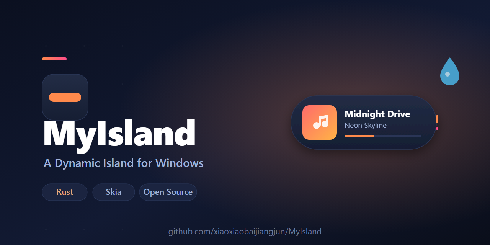

<div align="center">
  
  <h1>MyIsland</h1>
  <p><b>A Dynamic Island for Windows.</b><br>Music with synced lyrics, water reminders, and buttery spring animations — right above your taskbar.</p>

  <p>
    <a href="https://github.com/xiaoxiaobaijiangjun/MyIsland/releases"></a>
    
    
    
    <a href="README.zh-CN.md"></a>
  </p>

  <p>
    <a href="#-download"><b>Download</b></a> ·
    <a href="#-features"><b>Features</b></a> ·
    <a href="#-screenshots"><b>Screenshots</b></a> ·
    <a href="#-plugins"><b>Plugins</b></a> ·
    <a href="#-build-from-source"><b>Build</b></a>
  </p>
</div>

> **English** | [简体中文](README.zh-CN.md)

<!-- 🎬 Got a screen recording? Drop a GIF at docs/showcase/hero.gif and swap the src below — it's the #1 driver of stars. -->
<p align="center">
  
</p>

MyIsland brings the **Dynamic Island** experience from macOS to **Windows**. It docks a small, animated pill at the top of your screen that shows what your music player is doing — track title, album art, live audio visualizer, and **real-time synced lyrics** that scroll as the song plays. It also nudges you to drink water, and you can extend it with your own plugins.

Built in **Rust** with **Skia** for GPU-accelerated 2D rendering, and powered by Windows' [**SMTC**](https://learn.microsoft.com/en-us/windows/uwp/audio-video-camera/system-media-transport-controls) (System Media Transport Controls) — so it works with **every** media player on Windows, not just one.

---

## ✨ Features

| | Feature | What it means |
|---|---|---|
| 🎵 | **Music & Synced Lyrics** | Reads now-playing info from any media player via SMTC. Real-time lyrics with smooth line transitions and album art. |
| 🌊 | **Audio Visualizer** | Live spectrum bars derived from system audio. |
| 💧 | **Water Reminder** | Configurable interval (default 30 min) and active hours. Triggers a full-island popup so you actually notice it. |
| ✨ | **3 Visual Styles** | `Default` · `Mica` (Win11 desktop wallpaper tint) · `Dynamic Color` (follows album art). |
| 🪂 | **Spring Physics** | Every island expansion, collapse and page switch is driven by spring animations — no jank. |
| 🖱️ | **Scroll to Switch** | Mouse wheel over the island cycles between the Music and Lyrics pages. |
| 🔌 | **Plugin System** | Load external `.dll` plugins via the `myisland-plugin-api` crate. Ships with a packager for manifest + signing. |
| ⚙️ | **Highly Customizable** | Global scale, dock position, font, language (EN / 中文), autostart, and more. |
| 🌍 | **Bilingual UI** | Built-in English and Simplified Chinese, switchable in settings. |

## 📸 Screenshots

<!-- 📸 Optional: drop real screenshots into docs/showcase/ and add them here. The hero image above already showcases the app — add more once you have them. -->

## 🚀 Download

Grab the latest **`MyIsland.exe`** from the [**Releases**](https://github.com/xiaoxiaobaijiangjun/MyIsland/releases) page. No installer needed — just run it.

> Requires **Windows 10 1809+** or **Windows 11**. The Mica style looks best on Windows 11.

## 🎮 Usage

| Action | What it does |
|---|---|
| **Double-click** the island | Expand / collapse |
| **Scroll wheel** over the island | Switch between Music ↔ Lyrics pages |
| **Right-click** the tray icon | Settings · Show / Hide · Exit |
| **Settings → General → Water Reminder** | Enable drinking reminders |

## 🔌 Plugins

MyIsland ships a stable plugin API in the [`myisland-plugin-api`](crates/myisland-plugin-api) crate:

```rust
// Build a plugin against myisland-plugin-api, then drop the compiled .dll into:
//   %APPDATA%/MyIsland/plugins/{your-plugin-name}/
```

The crate also includes a **packager** for bundling plugins (manifest, packaging, signing). See [`crates/myisland-plugin-api/src/packager`](crates/myisland-plugin-api/src/packager) for details.

## 🛠️ Build from Source

**Requirements:** Rust (MSVC toolchain) + [Visual Studio 2022 Build Tools](https://visualstudio.microsoft.com/downloads/#build-tools-for-visual-studio-2022) with the **C++ workload**.

```bash
rustup default stable-msvc
cargo build --release
# Output: target/release/MyIsland.exe
```

## ❓ FAQ

<details>
<summary><b>It doesn't show any music info.</b></summary>

MyIsland relies on Windows SMTC, which your media player must broadcast to. Most modern players (Spotify, Edge, Chrome, Foobar2000 with a component, etc.) do. If nothing appears, check that the player is the one currently holding media control.
</details>

<details>
<summary><b>Windows Defender / SmartScreen warns about the exe.</b></summary>

There's no code-signing certificate yet. That's expected for a free, unsigned download — click **More info → Run anyway**. If you'd rather be safe, build from source (see above).
</details>

<details>
<summary><b>Where are settings stored?</b></summary>

Config and plugins live under `%APPDATA%/MyIsland/`.
</details>

## 🗺️ Roadmap

- [x] Music + lyrics, visual styles, water reminder, plugin API
- [ ] Timer / Pomodoro widget
- [ ] Screenshot tool integration
- [ ] More visual styles & themes
- [ ] Plugin marketplace / auto-update

## 🤝 Contributing

This is a young project — **contributions, bug reports and ideas are very welcome.**

1. Open an [issue](https://github.com/xiaoxiaobaijiangjun/MyIsland/issues) to discuss what you'd like to change
2. Fork → branch → commit with clear messages
3. Open a Pull Request

## 📄 License

[GPL-3.0](LICENSE). MyIsland is free and open-source software.

---

<div align="center">
  <sub>If MyIsland makes your desktop a little nicer, consider giving it a ⭐ — it really helps others discover it.</sub>
</div>
